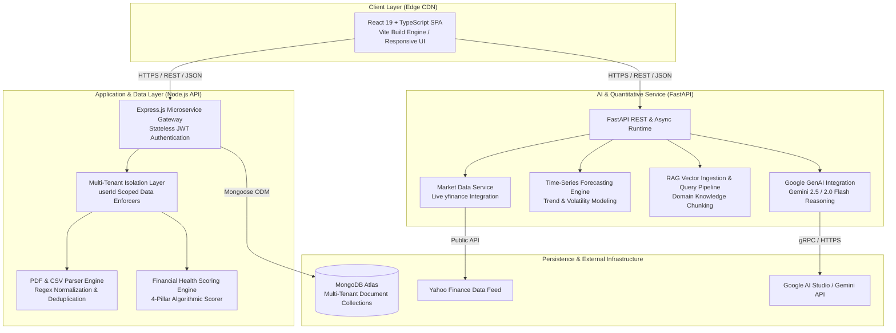
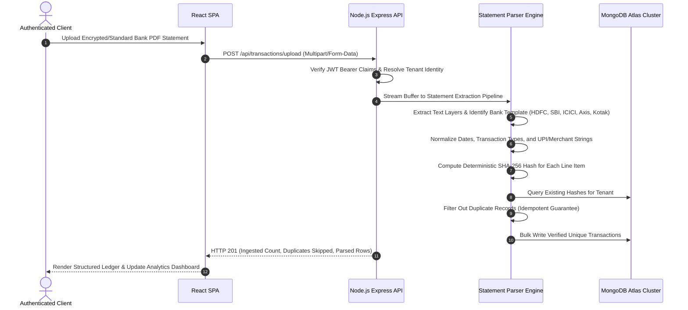

# Wallet-Mate: Enterprise-Grade Financial Intelligence, Automated Ledger Extraction, and AI-Powered Capital Compounding Platform

Live Deployment: https://wallet-mate-frontend-wzty.onrender.com/

---

## 1. Executive Summary & Problem Statement

Personal financial management across modern economies is severely hindered by systemic data fragmentation, opaque banking exports, and an absence of contextual intelligence. Modern consumers and wealth builders face multiple compounding friction points:

1. **Unstructured Data Silos and Ingestion Friction**: Retail banking institutions provide transaction records primarily as unstructured, proprietary PDF statements or non-standardized CSV exports. Manual reconciliation is error-prone, labor-intensive, and prone to duplicate entries across overlapping accounting cycles.
2. **Superficial Ledgering Without Algorithmic Health Scoring**: Existing budgeting utilities merely categorize historical outflows without evaluating systemic financial resilience. They fail to quantify essential health dimensions such as liquidity runway, debt-to-surplus ratios, spending velocity, and emergency contingency solvency.
3. **Information Asymmetry in Capital Allocation**: Retail investors lack access to institutional-grade time-series forecasting, algorithmic market risk assessment, and personalized portfolio optimization that factors in an individual's real-time discretionary liquidity.
4. **Ungrounded Generic AI Advice**: Generalized conversational large language models hallucinate generic financial advice because they lack deterministic access to a user's isolated transactional ledger, verified financial knowledge bases, and live market quotes.

**Wallet-Mate** addresses these challenges by delivering a decoupled, cloud-native microservices architecture. It combines deterministic PDF statement parsing, cryptographic data isolation, multi-pillar algorithmic financial scoring, real-time equity market forecasting, and Retrieval-Augmented Generation (RAG) via Google Gemini models.


website
https://wallet-mate-frontend-wzty.onrender.com


---

## 2. System Architecture & Component Topography

Wallet-Mate is designed as a distributed, decoupled multi-tier system optimized for horizontal scalability, stateless compute, and deterministic fault tolerance.

### 2.1 High-Level Architecture Diagram



### 2.2 Ingestion & Deduplication Pipeline



---

## 3. Core Architectural Modules & Engineering Specifications

### 3.1 Automated Bank Statement Parsing Engine
- **Multi-Bank Template Adaptation**: Native layout parsers engineered for major commercial institutions (HDFC, State Bank of India, ICICI Bank, Axis Bank, Kotak Mahindra Bank, and generic ISO standard statements).
- **Deterministic SHA-256 Idempotency**: Each transactional line item is processed into a deterministic string `(userId + date + amount + type + referenceNumber)` and hashed using SHA-256. Re-uploading identical or overlapping monthly statements results in zero duplicate writes.
- **Entity Resolution & Categorization**: Rule-based heuristic pattern matching extracts normalized merchant identities from complex UPI strings (e.g., `UPI-SWIGGY-12345` -> `Swiggy`, Category: `Food & Dining`).

### 3.2 Algorithmic Multi-Pillar Financial Health Engine
The platform calculates an objective composite Financial Health Score (0-100) based on four weighted quantitative dimensions:
1. **Savings Discipline Pillar (40% Weight)**: Evaluates the net savings rate `((Inflow - Outflow) / Inflow * 100)`. Tiered benchmarks reward consistent accumulation above 30%.
2. **Expense Velocity & Discretionary Outflow Pillar (25% Weight)**: Measures burn rate against income velocity, penalizing non-essential outflow spikes.
3. **Liquidity Runway & Reserve Pillar (20% Weight)**: Assesses available liquid capital against average monthly operational expenditures to quantify survival runway (target: 6+ months).
4. **Debt-to-Surplus Stability Pillar (15% Weight)**: Evaluates recurring fixed liabilities and EMI servicing burdens relative to gross disposable surplus.

### 3.3 Quantitative Market Intelligence & Predictive Inference
- **Real-Time Market Ingestion**: Integrates live tick and OHLCV market feeds via Yahoo Finance for Indian (NSE/BSE) and global equity instruments.
- **Zero-Shot Time-Series Forecasting**: Machine learning statistical pipelines analyze trailing historical windows to model probabilistic price paths, expected return bands, directionality, and volatility metrics.
- **Savings-Aware Position Sizing**: Translates user disposable surplus into actionable allocation brackets, matching risk profiles (Conservative, Moderate, Aggressive) with diversified market candidates.

### 3.4 Grounded Retrieval-Augmented Generation (RAG) AI Money Mentor
- **Vector Knowledge Base**: Indexes curated financial engineering literature, risk management principles, and investment methodologies.
- **Context Injection Pipeline**: Dynamic prompt construction combines vectorized knowledge retrieval with the user's live financial metadata (cash flow velocity, health score, category breakdown) to generate hallucination-free advisory responses.
- **Google GenAI Client Integration**: Leverages Google Gemini models (`gemini-2.5-flash`, `gemini-2.0-flash`, `gemini-1.5-flash`) with automated fallback orchestration.

### 3.5 Financial Education & Professional Certification Academy
- **Comprehensive Curriculum**: 50 specialized course modules across 11 professional tracks (Cash Flow Mastery, Equity Analysis, Fixed Income, Derivatives, Tax Optimization, Portfolio Architecture).
- **Proctored 100-Question Assessment Engine**: Real-time examination platform with algorithmic skill breakdown, timing controls, and tiered grading (Pass, Honors, Distinction).
- **Cryptographically Verifiable Credentials**: Dynamic generation of ISO-formatted certificates and diplomas embedded with unique verification serial identifiers (`FEA-EARN-2026-XXXX-XXXX`).

### 3.6 Multi-Tenant Isolation & Zero-Trust Security
- **Strict Data Ownership**: All MongoDB queries are scoped strictly by authenticated `userId` extracted from validated JSON Web Tokens (JWT).
- **Password Salting and Hashing**: Cryptographic password protection using `bcryptjs` with optimized cost factors.
- **Stateless Bearer Authorization**: Protected API boundaries guarded by middleware interceptors validating JWT signatures and token expiration.

---

## 4. Technology Stack Matrix

| Layer | Technologies & Libraries | Architectural Purpose |
| :--- | :--- | :--- |
| **Frontend UI/UX** | React 19, TypeScript, Vite, React Router 7, Zustand, Recharts, Lucide Icons | Client-side reactive Single Page Application |
| **Styling & Design System** | Vanilla CSS3 Variables, Glassmorphism, Responsive Grid System | Cohesive visual design system |
| **Backend API Gateway** | Node.js, Express.js 5, Mongoose 9, Multer, Helmet, Morgan, CORS | RESTful API routing, authentication, and database orchestration |
| **AI / ML Microservice** | Python 3.11, FastAPI, Uvicorn, Pandas, NumPy, Scikit-Learn, yfinance | Asynchronous quantitative computation, predictive modeling, market data |
| **Generative AI & LLM** | Google GenAI SDK (`google-genai`), Gemini 2.5/2.0/1.5 Flash Models | Context-grounded conversational mentor and stock reasoning |
| **Database & Persistence** | MongoDB Atlas, Distributed Document Storage | Persistent multi-tenant storage for users, transactions, and certifications |
| **Build & Infrastructure** | Render Cloud Platform (Static Sites, Node Web Services, Python Web Services) | Production hosting, automated CI/CD pipelines, edge CDN caching |

---

## 5. API Interface Specifications

### 5.1 Authentication Subsystem (`/api/auth`)
| Method | Endpoint | Description | Auth Required |
| :--- | :--- | :--- | :--- |
| `POST` | `/api/auth/register` | Create a new user identity and return a signed JWT | No |
| `POST` | `/api/auth/login` | Authenticate credentials and establish an authorized session | No |
| `GET` | `/api/auth/me` | Fetch authenticated identity metadata and profile details | Yes (Bearer) |
| `POST` | `/api/auth/reset-password` | Update account credentials via verified reset payload | No |

### 5.2 Transaction & Ledger Subsystem (`/api/transactions`)
| Method | Endpoint | Description | Auth Required |
| :--- | :--- | :--- | :--- |
| `GET` | `/api/transactions` | Retrieve user transactions with sorting and pagination | Yes (Bearer) |
| `POST` | `/api/transactions` | Record a single manual transactional entry | Yes (Bearer) |
| `POST` | `/api/transactions/upload` | Ingest and parse PDF/CSV bank statements with deduplication | Yes (Bearer) |
| `DELETE` | `/api/transactions/:id` | Remove a specified transaction with ownership verification | Yes (Bearer) |

### 5.3 Academy & Certification Subsystem (`/api/academy`)
| Method | Endpoint | Description | Auth Required |
| :--- | :--- | :--- | :--- |
| `GET` | `/api/academy/progress` | Retrieve completed modules, XP, exam attempts, and certificates | Yes (Bearer) |
| `POST` | `/api/academy/exam/submit` | Submit an official examination attempt and issue credentials | Yes (Bearer) |

### 5.4 AI & Market Intelligence Subsystem (`FastAPI`)
| Method | Endpoint | Description | Auth Required |
| :--- | :--- | :--- | :--- |
| `GET` | `/investment/quote/{symbol}` | Fetch real-time market quote and quality tags for a ticker | No |
| `POST` | `/investment/live-predict` | Generate time-series predictive return bands for a symbol | No |
| `POST` | `/ai/chat` | Query RAG-grounded AI Money Mentor with financial context | No |
| `POST` | `/api/v1/ai/function-chat`| Gemini tool calling integration with real-time market tools | No |

---

## 6. Environment Configuration Schema

### 6.1 Backend Web Service (`backend/api/.env`)
```env
PORT=10000
NODE_ENV=production
JWT_SECRET=your_secure_jwt_secret_key_here
MONGODB_URI=mongodb+srv://<username>:<password>@cluster0.xxxx.mongodb.net/finmitra?retryWrites=true&w=majority
```

### 6.2 Python AI Microservice (`ai-service/.env`)
```env
PORT=8000
HOST=0.0.0.0
PYTHON_VERSION=3.11.9
GEMINI_API_KEY=your_google_ai_studio_api_key
MARKET_DATA_PROVIDER=yfinance
RAG_VECTOR_STORE_PATH=./data/vectorstore
RAG_COLLECTION_NAME=finmitra_knowledge
RAG_TOP_K=5
RAG_RERANK_TOP_K=3
```

### 6.3 Frontend Static Application (`frontend/.env`)
```env
VITE_API_URL=https://wallet-mate-backend.onrender.com/api
VITE_AI_API_URL=https://wallet-mate-ai.onrender.com
```

---

## 7. Local Installation & Development Workflow

### Prerequisites
- Node.js 18.x or higher
- Python 3.10 or 3.11
- MongoDB instance (Local or MongoDB Atlas connection string)
- Git

### 7.1 Clone and Install Dependencies

```bash
# Clone the repository
git clone https://github.com/1pruthvik/Wallet-mate.git
cd Wallet-mate

# Install Frontend dependencies
cd frontend
npm install

# Install Backend dependencies
cd ../backend/api
npm install

# Install Python AI Service dependencies
cd ../../ai-service
pip install -r requirements.txt
```

### 7.2 Running the Development Services

```bash
# Terminal 1: Launch Backend API (Port 5000)
cd backend/api
npm run dev

# Terminal 2: Launch AI Service (Port 8000)
cd ai-service
uvicorn main:app --reload --host 0.0.0.0 --port 8000

# Terminal 3: Launch React Frontend (Port 5173)
cd frontend
npm run dev
```

---

## 8. Deployment Infrastructure & Verification

The application is deployed across Render's managed cloud infrastructure:
- **Frontend**: Render Static Site with global edge CDN distribution and client-side SPA route rewriting (`/*` -> `/index.html`).
- **Backend API**: Render Node.js Managed Web Service with automated health checking at `/api/health`.
- **AI Service**: Render Python Managed Web Service with Uvicorn ASGI server and zero-downtime deployments.
- **Database**: MongoDB Atlas multi-region cluster with automated backups and encryption at rest.

Live Production URL: https://wallet-mate-frontend-wzty.onrender.com/
